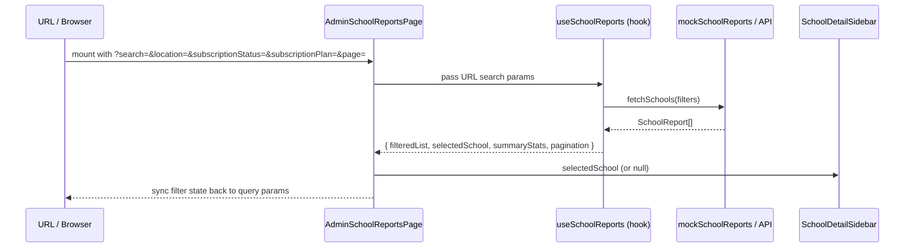

# Design Document: School Admin Report Page

## Overview

A frontend-only admin reporting dashboard for the School Management SaaS platform that lets administrators view, search, filter, and export detailed information about all managed schools. The page uses static mock data now and is structured so a real API call can replace the mock with minimal changes.

## Main Algorithm / Workflow



## Core Interfaces / Types

```typescript
// src/types/SchoolReport.ts

export type SchoolType = 'public' | 'private' | 'international';
export type SchoolStatus = 'active' | 'inactive';
export type SubscriptionPlan = 'basic' | 'pro' | 'enterprise';
export type SubscriptionStatus = 'active' | 'expired' | 'trial' | 'cancelled';
export type BillingCycle = 'monthly' | 'yearly';
export type PaymentStatus = 'paid' | 'unpaid' | 'overdue';

export interface SchoolReport {
  // Basic
  schoolId: string;
  schoolName: string;
  schoolCode: string;
  schoolType: SchoolType;
  foundedYear: number;
  status: SchoolStatus;

  // Location
  country: string;
  provinceOrState: string;
  city: string;
  district: string;
  address: string;
  postalCode: string;
  latitude: number;
  longitude: number;

  // Contact
  schoolEmail: string;
  phoneNumber: string;
  website: string;
  principalName: string;
  adminContactName: string;
  adminContactEmail: string;

  // Students
  totalStudents: number;
  maleStudents: number;
  femaleStudents: number;
  gradeLevels: string[];
  activeStudents: number;
  inactiveStudents: number;

  // Teachers
  totalTeachers: number;
  fullTimeTeachers: number;
  partTimeTeachers: number;
  teacherStudentRatio: string;

  // Infrastructure (optional)
  numberOfClassrooms?: number;
  numberOfBuildings?: number;
  libraryAvailable?: boolean;
  computerLabs?: number;
  sportsFacilities?: string[];

  // Subscription
  subscriptionPlan: SubscriptionPlan;
  subscriptionStatus: SubscriptionStatus;
  subscriptionStartDate: string;   // ISO date string
  subscriptionEndDate: string;     // ISO date string
  billingCycle: BillingCycle;
  paymentStatus: PaymentStatus;

  // System Usage
  createdAt: string;
  lastLoginAt: string;
  lastUpdatedAt: string;
  numberOfActiveUsers: number;
  numberOfAdminUsers: number;
}

export interface SchoolReportFilters {
  search: string;
  location: string;           // city or country free-text
  subscriptionStatus: SubscriptionStatus | '';
  subscriptionPlan: SubscriptionPlan | '';
  page: number;
}

export interface SchoolReportSummary {
  totalSchools: number;
  activeSchools: number;
  totalStudents: number;
  totalTeachers: number;
}
```

## Key Functions with Formal Specifications

### `useSchoolReports(filters: SchoolReportFilters)`

```typescript
function useSchoolReports(filters: SchoolReportFilters): {
  schools: SchoolReport[];
  filteredList: SchoolReport[];
  selectedSchool: SchoolReport | null;
  summaryStats: SchoolReportSummary;
  totalPages: number;
  loading: boolean;
  selectSchool: (id: string | null) => void;
}
```

**Preconditions:**
- `filters` is a valid `SchoolReportFilters` object
- `filters.page >= 1`

**Postconditions:**
- `filteredList` contains only schools matching all active filter criteria
- `filteredList` is a subset of `schools`
- `selectedSchool` is `null` or an element of `schools`
- `summaryStats` reflects counts over the full unfiltered `schools` array
- `totalPages = Math.ceil(filteredList.length / PAGE_SIZE)`

**Loop Invariants (filter pipeline):**
- Each filter step only removes items; it never adds new ones
- Order of items is preserved relative to the source array

---

### `filterSchools(schools, filters)`

```typescript
function filterSchools(
  schools: SchoolReport[],
  filters: SchoolReportFilters
): SchoolReport[]
```

**Preconditions:**
- `schools` is a non-null array (may be empty)
- `filters` fields are trimmed strings or empty strings

**Postconditions:**
- Returns array where every element satisfies all non-empty filter criteria
- `search` matches case-insensitively against `schoolName`, `city`, `country`, `schoolCode`
- `location` matches case-insensitively against `city`, `country`, `provinceOrState`
- `subscriptionStatus` exact-matches `school.subscriptionStatus` when non-empty
- `subscriptionPlan` exact-matches `school.subscriptionPlan` when non-empty
- Empty filter fields are treated as "match all"

---

### `exportToCSV(schools, filename)`

```typescript
function exportToCSV(schools: SchoolReport[], filename: string): void
```

**Preconditions:**
- `schools` is a non-empty array
- `filename` is a non-empty string

**Postconditions:**
- Triggers a browser file download of a `.csv` file
- CSV contains a header row followed by one row per school
- Columns include all table-visible fields plus key metrics
- No mutation of the `schools` array

---

### `syncFiltersToURL(filters, setSearchParams)`

```typescript
function syncFiltersToURL(
  filters: SchoolReportFilters,
  setSearchParams: (params: URLSearchParams) => void
): void
```

**Preconditions:**
- `filters` is a valid `SchoolReportFilters` object

**Postconditions:**
- URL query string reflects current filter state
- Empty/default filter values are omitted from the URL (clean URLs)
- `page=1` is omitted when on the first page

---

### `parsePaginatedPage(filteredList, page, pageSize)`

```typescript
function parsePaginatedPage<T>(
  list: T[],
  page: number,
  pageSize: number
): T[]
```

**Preconditions:**
- `page >= 1`
- `pageSize >= 1`

**Postconditions:**
- Returns slice `list[(page-1)*pageSize ... page*pageSize]`
- Returns empty array if `page` exceeds total pages
- Does not mutate `list`

## Algorithmic Pseudocode

### Main Filter + Pagination Algorithm

```pascal
ALGORITHM filterAndPaginate(schools, filters, pageSize)
INPUT:  schools  — SchoolReport[]
        filters  — SchoolReportFilters
        pageSize — integer > 0
OUTPUT: pagedResult — SchoolReport[], totalPages — integer

BEGIN
  // Step 1: text search
  IF filters.search ≠ '' THEN
    term ← lowercase(trim(filters.search))
    schools ← FILTER schools WHERE
      lowercase(s.schoolName) CONTAINS term OR
      lowercase(s.city)       CONTAINS term OR
      lowercase(s.country)    CONTAINS term OR
      lowercase(s.schoolCode) CONTAINS term
  END IF

  // Step 2: location filter
  IF filters.location ≠ '' THEN
    loc ← lowercase(trim(filters.location))
    schools ← FILTER schools WHERE
      lowercase(s.city)            CONTAINS loc OR
      lowercase(s.country)         CONTAINS loc OR
      lowercase(s.provinceOrState) CONTAINS loc
  END IF

  // Step 3: subscription status filter
  IF filters.subscriptionStatus ≠ '' THEN
    schools ← FILTER schools WHERE
      s.subscriptionStatus = filters.subscriptionStatus
  END IF

  // Step 4: subscription plan filter
  IF filters.subscriptionPlan ≠ '' THEN
    schools ← FILTER schools WHERE
      s.subscriptionPlan = filters.subscriptionPlan
  END IF

  // Step 5: paginate
  totalPages ← CEIL(LENGTH(schools) / pageSize)
  start      ← (filters.page - 1) * pageSize
  pagedResult ← schools[start .. start + pageSize - 1]

  ASSERT LENGTH(pagedResult) ≤ pageSize
  RETURN pagedResult, totalPages
END
```

### CSV Export Algorithm

```pascal
ALGORITHM exportToCSV(schools, filename)
INPUT:  schools  — SchoolReport[]
        filename — string
OUTPUT: side-effect: browser file download

BEGIN
  ASSERT LENGTH(schools) > 0

  headers ← [
    "School Name", "School Code", "Type", "Status",
    "Country", "City", "Province",
    "Total Students", "Active Students",
    "Total Teachers", "Teacher-Student Ratio",
    "Subscription Plan", "Subscription Status",
    "Billing Cycle", "Payment Status",
    "Subscription Start", "Subscription End",
    "Created At", "Last Login", "Active Users"
  ]

  rows ← []
  FOR each school IN schools DO
    row ← [
      school.schoolName, school.schoolCode, school.schoolType, school.status,
      school.country, school.city, school.provinceOrState,
      school.totalStudents, school.activeStudents,
      school.totalTeachers, school.teacherStudentRatio,
      school.subscriptionPlan, school.subscriptionStatus,
      school.billingCycle, school.paymentStatus,
      school.subscriptionStartDate, school.subscriptionEndDate,
      school.createdAt, school.lastLoginAt, school.numberOfActiveUsers
    ]
    rows.APPEND(escapeCSVRow(row))
  END FOR

  csvContent ← JOIN([headers, ...rows], newline)
  blob        ← new Blob([csvContent], { type: 'text/csv' })
  triggerDownload(blob, filename + '.csv')
END
```

### URL Sync Algorithm

```pascal
ALGORITHM syncFiltersToURL(filters, setSearchParams)
INPUT:  filters        — SchoolReportFilters
        setSearchParams — function(URLSearchParams) → void

BEGIN
  params ← new URLSearchParams()

  IF filters.search ≠ ''             THEN params.set('search', filters.search)
  IF filters.location ≠ ''           THEN params.set('location', filters.location)
  IF filters.subscriptionStatus ≠ '' THEN params.set('subscriptionStatus', filters.subscriptionStatus)
  IF filters.subscriptionPlan ≠ ''   THEN params.set('subscriptionPlan', filters.subscriptionPlan)
  IF filters.page > 1                THEN params.set('page', toString(filters.page))

  setSearchParams(params)
END
```

## Component Architecture

```
src/
├── pages/admin/
│   └── AdminSchoolReportsPage.jsx       ← route: /admin/reports
│
├── components/schoolReport/
│   ├── ReportFilters.jsx                ← search + 3 filter dropdowns
│   ├── ReportSummaryCards.jsx           ← 4 stat cards (total, active, students, teachers)
│   ├── SchoolReportTable.jsx            ← table wrapper + pagination
│   ├── SchoolReportRow.jsx              ← single clickable table row
│   ├── SchoolDetailSidebar.jsx          ← right-side detail panel
│   └── ExportCSVButton.jsx              ← export trigger button
│
├── hooks/
│   └── useSchoolReports.js              ← filter/pagination/selection logic
│
├── data/
│   └── mockSchoolReports.js             ← 20 mock school objects
│
├── types/
│   └── SchoolReport.ts                  ← all TypeScript types
│
└── utils/
    └── schoolReportUtils.js             ← filterSchools, exportToCSV, syncFiltersToURL
```

### Component Responsibilities

**`AdminSchoolReportsPage`**
- Reads URL search params via `useSearchParams`
- Owns top-level state: `selectedSchoolId`
- Composes all child components
- Passes filter state down; receives filter changes up via callbacks
- Calls `syncFiltersToURL` on every filter change

**`ReportFilters`**
- Props: `filters: SchoolReportFilters`, `onChange: (partial) => void`
- Renders: search text input, location text input, subscriptionStatus select, subscriptionPlan select
- Debounces search/location inputs (300 ms) before calling `onChange`

**`ReportSummaryCards`**
- Props: `summary: SchoolReportSummary`
- Renders 4 stat cards matching the existing Bootstrap card style used in `SchoolDashboard`

**`SchoolReportTable`**
- Props: `schools: SchoolReport[]`, `selectedId: string | null`, `onSelect: (id) => void`, `page`, `totalPages`, `onPageChange`
- Renders table header + `SchoolReportRow` per item + pagination controls
- Does NOT use DataTables (custom pagination to support URL sync)

**`SchoolReportRow`**
- Props: `school: SchoolReport`, `isSelected: boolean`, `onSelect: () => void`
- Renders one `<tr>` with columns: School Name, Location, Total Students, Total Teachers, Subscription Plan, Subscription Status, Created Date, Last Activity
- Highlights row when `isSelected`

**`SchoolDetailSidebar`**
- Props: `school: SchoolReport | null`, `onClose: () => void`
- Renders right-side panel with 7 sections (School Overview, Location, Contact, Student Stats, Teacher Stats, Subscription Details, System Usage)
- Shows empty/placeholder state when `school` is null

**`ExportCSVButton`**
- Props: `schools: SchoolReport[]`, `disabled: boolean`
- Calls `exportToCSV(schools, 'school-report')` on click
- Shows count of records to be exported in tooltip/label

**`useSchoolReports` hook**
- Accepts `filters: SchoolReportFilters`
- Internally calls `fetchSchools()` — currently returns mock data, ready to swap for `API.get('/admin/school-reports')`
- Returns `{ filteredList, pagedList, selectedSchool, summaryStats, totalPages, loading, selectSchool }`

## State Management

```typescript
// Inside AdminSchoolReportsPage

// URL-driven state (read from useSearchParams)
const filters: SchoolReportFilters = {
  search:             searchParams.get('search') ?? '',
  location:           searchParams.get('location') ?? '',
  subscriptionStatus: searchParams.get('subscriptionStatus') ?? '',
  subscriptionPlan:   searchParams.get('subscriptionPlan') ?? '',
  page:               Number(searchParams.get('page') ?? '1'),
};

// Local UI state
const [selectedSchoolId, setSelectedSchoolId] = useState<string | null>(null);

// Derived state (from hook)
const {
  filteredList,   // after all filters applied, before pagination
  pagedList,      // current page slice
  selectedSchool, // SchoolReport | null
  summaryStats,   // SchoolReportSummary
  totalPages,
  loading,
} = useSchoolReports(filters, selectedSchoolId);
```

## API Integration Seam

The hook isolates the data source behind a single async function:

```typescript
// hooks/useSchoolReports.js

// MOCK (current)
async function fetchSchools(): Promise<SchoolReport[]> {
  return mockSchoolReports;   // from data/mockSchoolReports.js
}

// FUTURE API swap — only this function changes:
// async function fetchSchools(): Promise<SchoolReport[]> {
//   const { data } = await API.get('/admin/school-reports');
//   return data;
// }
```

No other component needs to change when the API is ready.

## Mock Data Shape (sample — 2 of 20)

```typescript
// data/mockSchoolReports.js  (20 entries total)
export const mockSchoolReports: SchoolReport[] = [
  {
    schoolId: 'SCH-001',
    schoolName: 'Phnom Penh International School',
    schoolCode: 'PPIS',
    schoolType: 'international',
    foundedYear: 2005,
    status: 'active',
    country: 'Cambodia', provinceOrState: 'Phnom Penh', city: 'Phnom Penh',
    district: 'Chamkarmon', address: '123 Norodom Blvd', postalCode: '12000',
    latitude: 11.5564, longitude: 104.9282,
    schoolEmail: 'info@ppis.edu.kh', phoneNumber: '+855-23-123456',
    website: 'https://ppis.edu.kh', principalName: 'Dr. Sophea Keo',
    adminContactName: 'Dara Chan', adminContactEmail: 'admin@ppis.edu.kh',
    totalStudents: 1200, maleStudents: 620, femaleStudents: 580,
    gradeLevels: ['Grade 1','Grade 2','Grade 3','Grade 4','Grade 5','Grade 6'],
    activeStudents: 1150, inactiveStudents: 50,
    totalTeachers: 80, fullTimeTeachers: 65, partTimeTeachers: 15,
    teacherStudentRatio: '1:15',
    numberOfClassrooms: 40, numberOfBuildings: 3, libraryAvailable: true,
    computerLabs: 2, sportsFacilities: ['Football Field', 'Basketball Court'],
    subscriptionPlan: 'enterprise', subscriptionStatus: 'active',
    subscriptionStartDate: '2024-01-01', subscriptionEndDate: '2024-12-31',
    billingCycle: 'yearly', paymentStatus: 'paid',
    createdAt: '2023-06-15T08:00:00Z', lastLoginAt: '2025-05-20T10:30:00Z',
    lastUpdatedAt: '2025-05-18T09:00:00Z',
    numberOfActiveUsers: 95, numberOfAdminUsers: 5,
  },
  {
    schoolId: 'SCH-002',
    schoolName: 'Siem Reap Public High School',
    schoolCode: 'SRPHS',
    schoolType: 'public',
    foundedYear: 1998,
    status: 'active',
    country: 'Cambodia', provinceOrState: 'Siem Reap', city: 'Siem Reap',
    district: 'Svay Dangkum', address: '45 Angkor Road', postalCode: '17000',
    latitude: 13.3671, longitude: 103.8448,
    schoolEmail: 'contact@srphs.edu.kh', phoneNumber: '+855-63-987654',
    website: 'https://srphs.edu.kh', principalName: 'Mr. Virak Phan',
    adminContactName: 'Sreymom Lim', adminContactEmail: 'admin@srphs.edu.kh',
    totalStudents: 850, maleStudents: 430, femaleStudents: 420,
    gradeLevels: ['Grade 7','Grade 8','Grade 9','Grade 10','Grade 11','Grade 12'],
    activeStudents: 820, inactiveStudents: 30,
    totalTeachers: 45, fullTimeTeachers: 40, partTimeTeachers: 5,
    teacherStudentRatio: '1:19',
    numberOfClassrooms: 25, numberOfBuildings: 2, libraryAvailable: true,
    computerLabs: 1, sportsFacilities: ['Football Field'],
    subscriptionPlan: 'basic', subscriptionStatus: 'trial',
    subscriptionStartDate: '2025-04-01', subscriptionEndDate: '2025-06-30',
    billingCycle: 'monthly', paymentStatus: 'unpaid',
    createdAt: '2025-03-10T07:00:00Z', lastLoginAt: '2025-05-19T14:00:00Z',
    lastUpdatedAt: '2025-05-19T14:00:00Z',
    numberOfActiveUsers: 12, numberOfAdminUsers: 2,
  },
  // ... 18 more entries covering: Bangkok, Hanoi, Singapore, Kuala Lumpur,
  //     Jakarta, Manila, Yangon, Vientiane, Ho Chi Minh City, Battambang,
  //     Kampot, Kandal, Takeo, Kompong Cham, Preah Sihanouk, Kep, Kratie, Mondulkiri
];
```

## UI Layout

```
┌─────────────────────────────────────────────────────────────────────────┐
│  MasterLayout (existing admin sidebar + navbar)                         │
│  ┌───────────────────────────────────────────────────────────────────┐  │
│  │  Page Header: "School Reports"          [Export CSV (N records)]  │  │
│  ├───────────────────────────────────────────────────────────────────┤  │
│  │  Summary Cards: Total Schools | Active | Total Students | Teachers│  │
│  ├───────────────────────────────────────────────────────────────────┤  │
│  │  Filters: [Search...] [Location...] [Sub Status ▼] [Plan ▼]      │  │
│  ├──────────────────────────────────┬────────────────────────────────┤  │
│  │  School Table (left ~60%)        │  Detail Sidebar (right ~40%)   │  │
│  │  ┌──────────────────────────┐    │  ┌──────────────────────────┐  │  │
│  │  │ Name | Location | ...    │    │  │ School Overview          │  │  │
│  │  │ ► row (selected)         │    │  │ Location                 │  │  │
│  │  │   row                    │    │  │ Contact Information      │  │  │
│  │  │   row                    │    │  │ Student Statistics       │  │  │
│  │  └──────────────────────────┘    │  │ Teacher Statistics       │  │  │
│  │  [← 1 2 3 ... →]                │  │ Subscription Details     │  │  │
│  │                                  │  │ System Usage Metrics     │  │  │
│  │                                  │  └──────────────────────────┘  │  │
│  └──────────────────────────────────┴────────────────────────────────┘  │
└─────────────────────────────────────────────────────────────────────────┘
```

## Routing & Permissions

```typescript
// Addition to src/App.js
<Route element={<Gate anyPerm={["menu.reports"]} />}>
  <Route path="/admin/reports" element={<AdminSchoolReportsPage />} />
</Route>
```

The `showReports` flag already exists in `MasterLayout.jsx` and the sidebar link to `/admin/reports` is already rendered — this route just needs to be wired up.

## Example Usage

```tsx
// src/pages/admin/AdminSchoolReportsPage.jsx (skeleton)
import { useSearchParams } from 'react-router-dom';
import MasterLayout from '../../masterLayout/MasterLayout';
import { useSchoolReports } from '../../hooks/useSchoolReports';
import ReportFilters from '../../components/schoolReport/ReportFilters';
import ReportSummaryCards from '../../components/schoolReport/ReportSummaryCards';
import SchoolReportTable from '../../components/schoolReport/SchoolReportTable';
import SchoolDetailSidebar from '../../components/schoolReport/SchoolDetailSidebar';
import ExportCSVButton from '../../components/schoolReport/ExportCSVButton';
import { syncFiltersToURL } from '../../utils/schoolReportUtils';

export default function AdminSchoolReportsPage() {
  const [searchParams, setSearchParams] = useSearchParams();
  const [selectedSchoolId, setSelectedSchoolId] = useState(null);

  const filters = {
    search:             searchParams.get('search') ?? '',
    location:           searchParams.get('location') ?? '',
    subscriptionStatus: searchParams.get('subscriptionStatus') ?? '',
    subscriptionPlan:   searchParams.get('subscriptionPlan') ?? '',
    page:               Number(searchParams.get('page') ?? '1'),
  };

  const { pagedList, filteredList, selectedSchool, summaryStats, totalPages, loading } =
    useSchoolReports(filters, selectedSchoolId);

  const handleFilterChange = (partial) => {
    const next = { ...filters, ...partial, page: 1 };
    syncFiltersToURL(next, setSearchParams);
  };

  return (
    <MasterLayout>
      <div className="d-flex justify-content-between align-items-center mb-3">
        <h5 className="fw-semibold mb-0">School Reports</h5>
        <ExportCSVButton schools={filteredList} disabled={loading} />
      </div>
      <ReportSummaryCards summary={summaryStats} />
      <ReportFilters filters={filters} onChange={handleFilterChange} />
      <div className="d-flex gap-3 mt-3">
        <div style={{ flex: selectedSchool ? '0 0 60%' : '1' }}>
          <SchoolReportTable
            schools={pagedList}
            selectedId={selectedSchoolId}
            onSelect={setSelectedSchoolId}
            page={filters.page}
            totalPages={totalPages}
            onPageChange={(p) => handleFilterChange({ page: p })}
            loading={loading}
          />
        </div>
        {selectedSchool && (
          <div style={{ flex: '0 0 38%' }}>
            <SchoolDetailSidebar
              school={selectedSchool}
              onClose={() => setSelectedSchoolId(null)}
            />
          </div>
        )}
      </div>
    </MasterLayout>
  );
}
```

## Correctness Properties

- For all filter states, `filteredList` is always a subset of the full `schools` array
- For all `school` in `filteredList`, every active filter criterion is satisfied
- `selectedSchool` is always either `null` or an element of the full `schools` array
- `summaryStats.totalSchools` equals the length of the full unfiltered `schools` array
- `pagedList.length <= PAGE_SIZE` for all valid inputs
- `exportToCSV` produces a CSV with exactly `schools.length + 1` lines (header + data rows)
- URL query params always reflect the current filter state after any filter change
- Clearing all filters restores `filteredList` to the full `schools` array
- `totalPages = Math.ceil(filteredList.length / PAGE_SIZE)` holds for all inputs

## Dependencies

All dependencies are already present in `package.json`:
- `react`, `react-dom`, `react-router-dom` — core framework
- `@iconify/react` — icons (consistent with existing pages)
- `bootstrap` — layout and utility classes (consistent with existing pages)
- `axios` / `src/helper/api.js` — future API integration seam
- `src/context/AuthContext.jsx` — permission guard (`menu.reports`)
- `src/masterLayout/MasterLayout.jsx` — admin shell layout
- `src/components/router/Gate.jsx` — route permission guard

No new npm packages are required.
